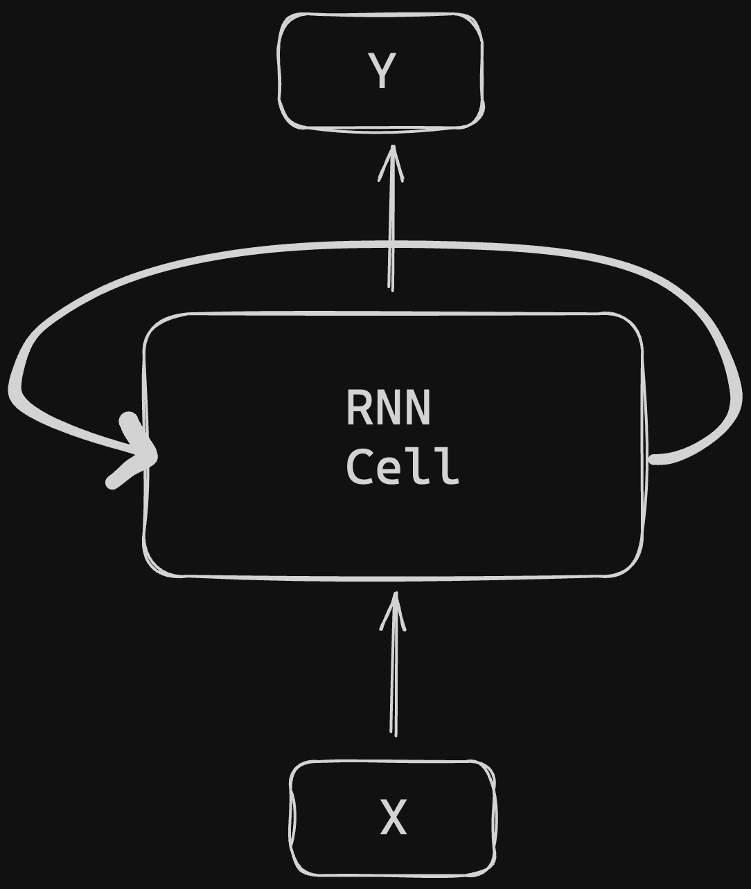

# Min Mamba
simple implementation of Mamba model with tensorflow

the original paper : [here](https://arxiv.org/abs/2312.00752) 


## What is Mamba ? 
Mamba at it's core is a recurrent neural network architecture, that outperforms Transformers with faster inference and improved handling of long sequences of length up to 1 million

## Why Mamba ? 
Mamba is 5x faster throughput than Transformers and scales linearly instead of quadratically with the length of the sequence.

## Why called Mamba ?
They call it Mamba because the build on work called S4 models to create “selective structured state space sequence models” , so it has alot of sss...like snake sound 🐍

The problem is that transformers do not scale that well to long sequence lengths. This is because the self attention mechanism is quadratic. Every word has to attend to every other word in the sentence n^2,
for example the sentence below there are 21 tokens, and 21*21=441 combinations the network has to compute through the keys, queries, and values matrices : 


while the core of Mamba model is RNN , lets see why?

because RNN is linear architecture :


RNN Issues :
1. Fast for generation but slow in training.
2. Collapse all the information down to a hidden space, and tend to forget information on longer sequences.

lets dive into the architecture of Mamba:


as we can see from the architecture the new is 
**SSM (Structured State Space Model)** : 
are at the core of Mamba, so it is important to note how they work. You can think of them as the replacement for the self attention mechanism in a transformer,<br/><br/>

A state space model takes in a 1D input sequence, maps to a N-D latent space and then projects back to a 1D output sequence.


**SSMs** like S4 can be defined as through these equations: 

```
h'(t) = Ah(t) + Bx(t)
y(t) = Ch(t)
```
the first equation : 


the second equation : 


## Refrences : 
https://blog.oxen.ai/mamba-linear-time-sequence-modeling-with-selective-state-spaces-arxiv-dives/
